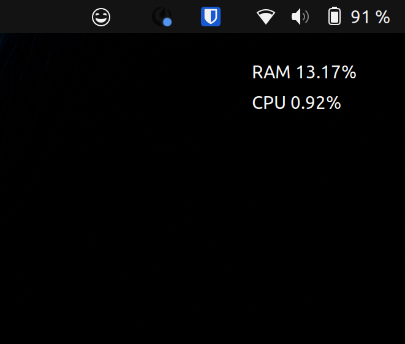

# GNOME HUD (WIP)



GNOME Shell extension for displaying system information like CPU usage, RAM usage, GPU usage, and FPS.

## Installation

**Manual**

1. Download or clone the repository to `~/.local/share/gnome-shell/extensions/`
2. Rename the repository's folder to `gnomehud@ashtonn.com`
3. Restart the GNOME Shell with `Alt` + `F2`, `r`, then `Enter`. Alternatively, log out or restart the computer
4. If the extension isn't already enabled, use `gnome-extensions enable gnomehud@ashtonn.com`

**Bundle**

1. Download the `.zip` extension bundle
2. Run `gnome-extensions install gnomehud@ashtonn.com.shell-extension.zip`
3. Restart the GNOME Shell with `Alt` + `F2`, `r`, then `Enter`. Alternatively, log out or restart the computer
4. If the extension isn't already enabled, use `gnome-extensions enable gnomehud@ashtonn.com`

*If the extension does not appear, make sure you have user extensions enabled with `gsettings set org.gnome.shell disable-user-extensions false`*

## Settings & Configuration

Extension settings can be accessed through the indicator in the status area with the 'Settings' button. Alternatively, open the settings dialog manually with `gnome-extensions prefs gnomehud@ashtonn.com`.

## Development

### View GNOME shell logs

```
journalctl -f -o cat /usr/bin/gnome-shell
```

### Pack Extension

```
gnome-extensions pack gnomehud@ashtonn.com --podir=po --extra-source={indicator.js,overlay.js}
```

### Compile (Preferences) Schemas

```
glib-compile-schemas schemas/
```

### Generate Translations

```
xgettext --from-code=UTF-8 --output=po/example.pot *.js
```