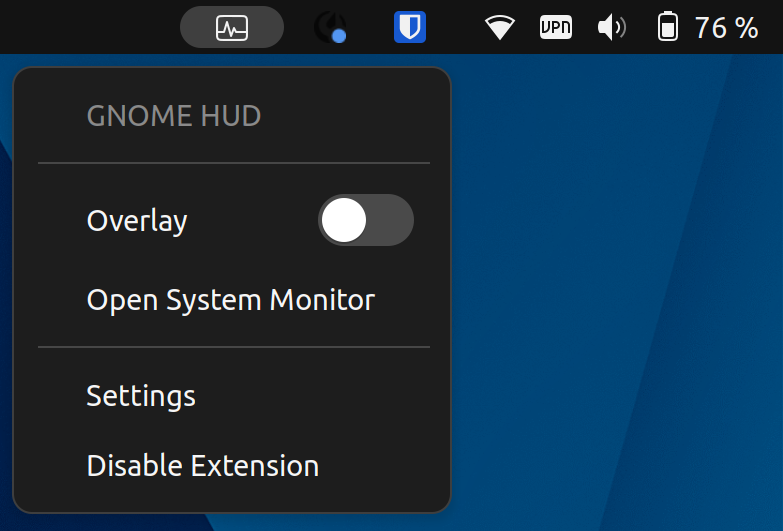
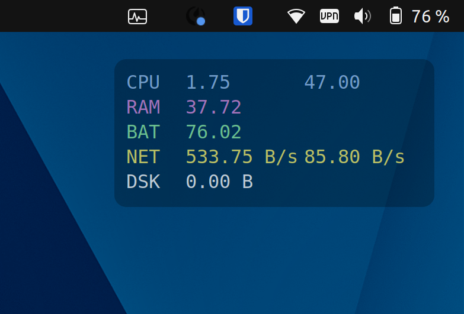
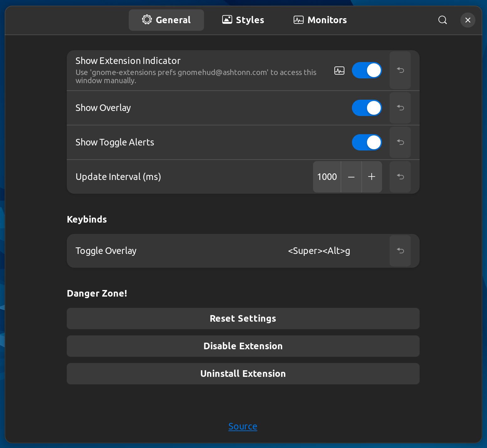
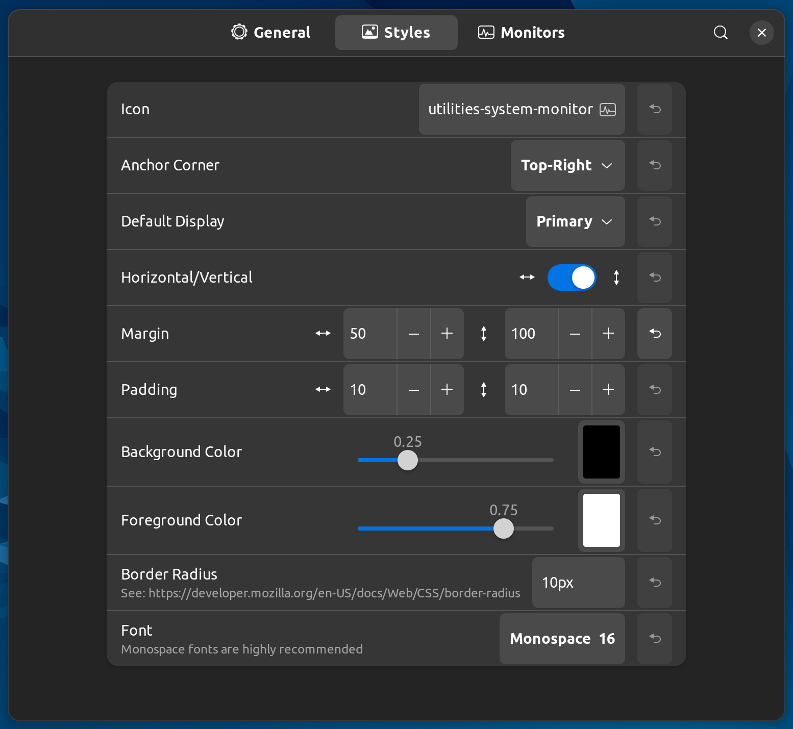
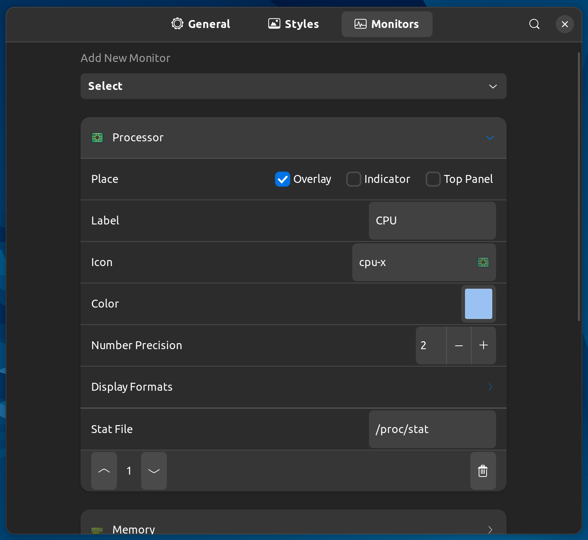

# GNOME HUD <sup>WIP</sup>

[GNOME Shell](https://www.gnome.org/) extension for displaying system information like CPU usage, RAM usage, GPU usage, and FPS.

**Under active initial development, everything subject to change.**

**Screenshots**  
<details>
    
    <p>Indicator Popup Menu</p>
    
    <p>Example Overlay</p>
    
    <p>Preferences Window (General)</p>
    
    <p>Preferences Window (Styles)</p>
    
    <p>Preferences Window (Monitors)</p>
</details>

## Installation

**Manual**

1. Download or clone the repository to `~/.local/share/gnome-shell/extensions/`
2. Rename the repository's folder to `gnomehud@ashtonn.com`
3. Restart the GNOME Shell with `Alt` + `F2`, `r`, then `Enter`. Alternatively, log out or restart the computer
4. If the extension isn't already enabled, use `gnome-extensions enable gnomehud@ashtonn.com`

**Bundle**

1. Download the `.zip` extension bundle
2. Run `gnome-extensions install gnomehud@ashtonn.com.shell-extension.zip`
3. Restart the GNOME Shell with `Alt` + `F2`, `r`, then `Enter`. Alternatively, log out or restart the computer
4. If the extension isn't already enabled, use `gnome-extensions enable gnomehud@ashtonn.com`

*If the extension does not appear, make sure you have user extensions enabled with `gsettings set org.gnome.shell disable-user-extensions false`*

## Usage

Use `Super` + `Alt` + `G` to toggle the overlay.

## Settings & Configuration

Extension settings can be accessed through the indicator in the status area with the 'Settings' button. Alternatively, open the settings window manually with `gnome-extensions prefs gnomehud@ashtonn.com`.

## Development

### View logs

**GNOME Shell**  
*GNOME shell, overlay, and indicator logs*

```
journalctl -f -o cat /usr/bin/gnome-shell
```

**GJS**  
*Preferences window logs*

```
journalctl -f -o cat /usr/bin/gjs
```

### Compile (Preferences) Schemas

```
glib-compile-schemas schemas/
```

### Generate Translations

```
xgettext --from-code=UTF-8 --output=po/example.pot *.js monitors/*.js
```

### Pack Extension

```
gnome-extensions pack gnomehud@ashtonn.com --podir=po --extra-source={*.js}
```

### Useful Links

| Name | Link |
|------|------|
| GJS Docs | https://gjs-docs.gnome.org/ |
| GJS Guide | https://gjs.guide/extensions/ |
| GNOME Shell Source | https://gitlab.gnome.org/GNOME/gnome-shell/-/tree/main/js/ui |
| Icon Spec | https://specifications.freedesktop.org/icon-naming-spec/icon-naming-spec-latest.html |
